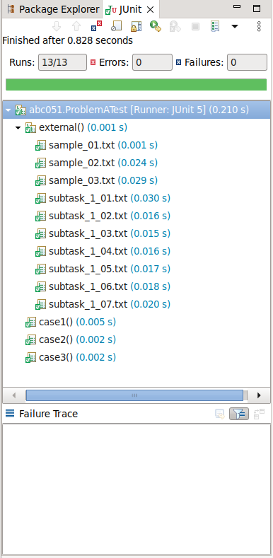

# atcoder.java
My answers to Atcoder problems written in Java.

以下の点にご注意ください。
- あくまでもAtcoder提出用のため、入力チェック、例外処理は一切実施していません。
- コードはAtcoderの解説やほかの方の提出コードを参考に作成されたものが多いため、ライセンスをGPL3.0といたします。

## 外部テストケースの使い方
1. src/test/resources/external.properties.sample をコピーし、src/test/resources/external.properties ファイルを作成する

1. src/test/resources/external.properties を以下のように編集する
```
# 外部フォルダーを使用するかどうか
USE_EXTERNAL=true
# 外部フォルダーを指定する
EXTERNAL_FOLDER=外部フォルダーのパス
```

1. [Atcoderのテストケース](https://www.dropbox.com/sh/nx3tnilzqz7df8a/AAAYlTq2tiEHl5hsESw6-yfLa?dl=0) からテストケースをzip形式でダウンロードし、外部フォルダーに配置する。
例えば、ABC051のテストケースはABC051.zipとして、ダウンロードされる。

1. 該当のテストファイルに以下のようなコードを追加する
```
	@TestFactory
	Collection<DynamicTest> external() {
		return checkExternal("ABC051/A");
	}
```
ここでの`ABC051/A`の最後の`A`はA問題を意味する

1. 該当のテストクラスをJUnitで実行する
Eclipseでは以下の画像のようになれば、設定が正しいことが確認できる。

